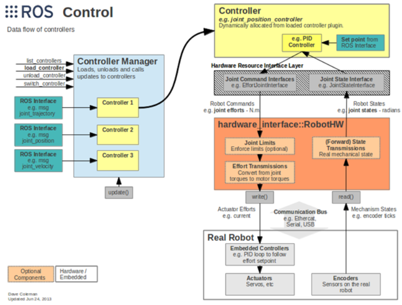

# 搭建Moveit！+ Gazebo 机械臂仿真

源码：[ROS-/probot_arm_simulation at main · linxinloningg/ROS- (github.com)](https://github.com/linxinloningg/ROS-/tree/main/probot_arm_simulation)

环境安装：

* Moveit！

  ```bash
  sudo apt-get install ros-<ROS版本>-moveit-full
  ```

* ros_contorller

  ```bash
  sudo apt-get install ros-<ROS版本>-joint-state-controller 
  sudo apt-get install ros-<ROS版本>-effort-controllers
  sudo apt-get install ros-<ROS版本>-position-controllers
  sudo apt-get install ros-<ROS版本>-joint-trajectory-controller
  ```

* [Gazebo](https://classic.gazebosim.org/tutorials?tut=ros_installing)

  ```bash
  sudo apt-get install ros-<ROS版本>-gazebo-ros-pkgs ros-noetic-gazebo-ros-control
  sudo apt-get install ros-noetic-gazebo-ros-pkgs ros-noetic-gazebo-ros-control
  ```

1. ## MoveIt!介绍

   >MoveIt!是一个集成的机械手臂库，提供多种功能，包括用于运动规划的快速逆运动 学分析、用于操纵的高级算法、机械手控制、动力学、控制器和运动规划。

2. ## Moveit!框架图

   >

3. ## Moveit!的核心节点move_group

   >move_group节点充当集成器：将所有单个组件拉在一起，以提供一组ROS操作和服务供用户使用。
   >
   >
   >
   >* #### 1.用户接口（MoveIt!提供三种可供调用的接口）
   >
   >  * C++:使用move_group_interface包提供的API
   >  * Python:使用moveit_commander包提供的API
   >  * GUI:使用MoveIt!的rviz插件
   >
   >  ***这方面主要涉及控制（代码控制或GUI控制）***
   >
   >* #### 2.ROS参数服务器
   >
   >  * URDF:从ROS参数服务器中查找robot_description参数,获取机器人模型的描述信息
   >  * SRDF:从ROS参数服务器中查找robot_description_semantic参数,获取机器人模型的一些配置信息,这些配置信息通过配置工具MoveIt!Setup Assistant生成
   >  * Config:机器人的其他配置信息,例如关节限位、运动学插件、运动规划插件等
   >
   >  ***move_group节点从URDF、Semantic Robot Description Format（SRDF）和 MoveIt! Configuration接收关于机器人的信息。URDF使用先前创建的文件，而SRDF和 MoveIt! Configuration将通过MoveIt!提供的Setup Assistant创建***
   >
   >  **！！！也就是说我们当我们已经拥有一个模型文件(URDF)，需要借用Setup Assistant去帮助构建SRDF和Configure文件**
   >
   >* #### 3.机器人接口（move_group和机器人之间通过Topic和Action通信）
   >
   >  move_group节点通过ROS话题和动作提供机器人的状态与控制，还提供周围环境。关节状态是通过sensor_msgs/JointStates消息。
   >
   >  变换信息是通过tf库，控制器是通过FollowTrajectoryAction接口向用户发送关于机器人的信息。另外，通过planning scene向用户提供关于机器人工作的环境信息和机器人的状态。

4. ## 学会使用MoveIt！

   >MoveIt！驱动功能包目录：
   >
   >---src
   >
   >------description_pkg（存放urdf文件的包）
   >
   >------moveit_config（存放由Setup Assistant生成的配置文件）
   >
   >综上所述，学会使用MoveIt！只需要走三步就行了
   >
   >1. 拥有一个模型文件URDF
   >     * 组装：在控制之前需要有机器人，可以是真实的机械臂，也可以是仿真的机械臂，但都要创建完整的机器人urdf模型
   >
   >2. 通过MoveIt!提供的Setup Assistant对模型文件进行配置生成SRDF和Configuration
   >     * 配置：使用MoveIt！控制机械臂之前，需要根据机器人urdf模型，使用Setup Assistant工具完成自碰撞矩阵、规划组、终端夹具等配置，配置完成后生成一个ROS功能包
   >
   >3. 进行GUI控制或通过编辑代码控制
   >     * 控制：MoveIt！提供了C++、Python、rviz插件等接口，可以实现机器人关节空间和工作空间下的运动规划，规划过程中会综合考虑场景信息，并实现自主避障的优化控制
   >
   >* #### 拥有一个模型文件URDF
   >
   >* #### 通过MoveIt!提供的Setup Assistant对模型文件进行配置生成SRDF和Configuration
   >
   >  举例说明：
   >
   >  * ##### 在终端中输入以下命令运行MoveIt! Setup Assistant
   >
   >    ```bash
   >     roslaunch moveit_setup_assistant setup_assistant.launch
   >    ```
   >
   >    
   >
   >  * ##### 在左侧窗口中选择创建新的功能包还是修改现有的功能包。现在我们需要创建一个新的功能包，所以让我们点击Create New  MoveIt Configuration Package按钮
   >
   >    
   >
   >    MoveIt! Setup Assistant会根据存储在URDF文件或COLLADA文件中的机器人模型，通过附加的设置生成SRDF文件。点击Browse按钮，打开urdf或者xacro文件，然后点击Load Files按钮。
   >
   >  * ##### 设置构建Self-Collision Matrix（自碰撞矩阵）所需的Sampling density（采样密度），并可以根据需要确定组成机器人的连杆之间的碰撞范围
   >
   >    
   >
   >    Sampling density 越高，需要越多的计算来防止机器人在各种姿态中的连杆之间的碰撞，因此需要用户的工 作环境进行适当的设置。设置需要的Sampling density，然后单击Generate Collision  Matrix按钮。默认值设置为10,000。
   >
   >  * ##### 配置虚拟关节
   >
   >    虚拟关节主要用来描述机器人在world坐标系下的位置。如果机器人是移动的，则虚拟关节可以与移动基座关联，但这里设计的机械臂是固定不动的，所以无需设置虚拟关节
   >
   >  * ##### 创建规划组
   >
   >    
   >
   >    MoveIt!将机械手臂分为几个组，为各组分别提供运动规划，用户可以在Planning  Groups页面上进行分组
   >
   >    
   >
   >    可以指定组名称并选择所需的运动分析插件（Kinematic Slover项 目）。组名设为arm，并选择需要的机械学解析插件。因为将要以关节为单元分组，因此 点击Add joint按钮。如果如图所示变化，则选择第一个关节到第四个关节，然 后单击Save按钮，则可以看到已创建的组
   >
   >    
   >
   >    
   >
   >    创建gripper组，将运动学分析插件 设置为None。并且像arm组一样，在Add joints中，选择相关的关节grip_joint和grip_ joint_sub
   >
   >    
   >
   >  * ##### 定义机器人位姿
   >
   >    这一步可以设置一些自定义的位姿，比如机器人的初始姿态、指定姿态和位姿等。当然，这些位姿是开发者根据场景自定义的，不一定与机器人本身的位姿相同。这样做的好处是，当使用MoveIt！的API编程时，可以直接通过名称调用这些位姿。点击“Add Pose”按钮，在出现的界面中设置第一位姿——zero_pose。首先在“Pose Name”输入框中输入位姿名称，再选择对应的规划组为arm。该位姿的机器人姿态是六轴角度都处于0位置，可以理解为是机器人的初始位姿。设置完成后，点击“Save”按钮保存。
   >
   >    
   >
   >  * ##### 配置末端执行器
   >
   >    机械臂在一些实用场景下会安装夹具等终端结构，可以在这一步中添加。
   >
   >    点击“Add End Effector”按钮，按照下图进行配置。
   >
   >    - End Effector Name：robot_gripper。
   >    - End Effector Group：gripper。
   >    - Parent Link (usually part of arm)：link5。
   >    - Parent Group (optional)：可选项，不需要设置。
   >
   >    
   >
   >  * ##### 配置无用关节
   >
   >    机器人上的某些关节可能在规划、控制过程中使用不到，可以先声明出来，MArm没有类似joint，这一步不需要配置
   >
   >  * ##### 设置作者信息
   >
   >    这一步可以设置作者的信息，如下图所示，根据情况填写
   >
   >    
   >
   >  * ##### 生成配置文件
   >
   >    最后一步按照之前的配置，自动生成配置功能包中的所有文件。
   >
   >    点击“Browse”按钮，选择一个存储配置功能包的路径。Setup Assistant会将所有配置文件打包生成一个ROS功能包，一般命名为“RobotName_moveit_config”。
   >
   >    点击“Generate Package”按钮，如果成功生成并保存配置文件，则可以看到“Configuration package generated successfully！”的消息提示。
   >
   >    
   >
   >  **至此，MoveIt! Setup Assistant已经完成！！！**

5. ## 认识ros_contorller

   >ROS中提供了丰富的机器人应用：SLAM、导航、MoveIt......但是你可能一直有一个疑问，这些功能包到底应该怎么样用到我们的机器人上，也就是说在应用和实际机器人或者机器人仿真器之间，缺少一个连接两者的东西。
   >
   >ros_control就是ROS为用户提供的应用与机器人之间的中间件，包含一系列控制器接口、传动装置接口、硬件接口、控制器工具箱等等，可以帮助机器人应用快速落地，提高开发效率。
   >
   >
   >
   >ros_control的数据流图：
   >
   >
   >
   >- Controller Manager：每个机器人可能有多个controller，所以这里有一个控制器管理器的概念，提供一种通用的接口来管理不同的controller。controller manager的输入就是ROS上层应用的输出。
   >- Controller：controller可以完成每个joint的控制，请求下层的硬件资源，并且提供了PID控制器，读取硬件资源接口中的状态，在发布控制命令。
   >- Hardware Rescource：为上下两层提供硬件资源的接口。
   >- RobotHW：硬件抽象层和硬件直接打交道，通过write和read方法来完成硬件的操作，这一层也包含关节限位、力矩转换、状态转换等功能。
   >- Real Robot：实际的机器人上也需要有自己的嵌入式控制器，接收到命令后需要反映到执行器上，比如接收到位置1的命令后，那就需要让执行器快速、稳定的到达位置1。
   >
   >[ros_controllers](http://wiki.ros.org/ros_controllers)这个功能包提供了已有的一些controllers（当然是需要安装的）：
   >
   >
   >
   >
   >
   >

6. ## 设计机械臂控制系统

   >Moveit!机械臂控制系统框图：
   >
   >
   >
   >重点：
   >
   >* Follow Joint Trajectory配置
   >* Joint Trajectory Controller配置
   >* Joint State Controller配置
   >* 
   >
   >1. ### 配置Gazebo端的Joint Trajectory Controller
   >
   >   这是action通信的server端，其中的关节名称必须要与机器人模型中的joint名称一致，并通过launch文件加载配置参数并启动控制器。
   >
   >   * 参数配置（probot_arm_simulation\src\moveit_config\config\ros_controllers.yaml）
   >
   >     ```yaml
   >     arm_controller:
   >       type: position_controllers/JointTrajectoryController
   >       joints:
   >         - joint_1
   >         - joint_2
   >         - joint_3
   >         - joint_4
   >         - joint_5
   >         - joint_6
   >       gains:
   >         joint_1:
   >           p: 100
   >           d: 1
   >           i: 1
   >           i_clamp: 1
   >         joint_2:
   >           p: 100
   >           d: 1
   >           i: 1
   >           i_clamp: 1
   >         joint_3:
   >           p: 100
   >           d: 1
   >           i: 1
   >           i_clamp: 1
   >         joint_4:
   >           p: 100
   >           d: 1
   >           i: 1
   >           i_clamp: 1
   >         joint_5:
   >           p: 100
   >           d: 1
   >           i: 1
   >           i_clamp: 1
   >         joint_6:
   >           p: 100
   >           d: 1
   >           i: 1
   >           i_clamp: 1
   >     ```
   >
   >   * 控制器启动（probot_arm_simulation\src\moveit_config\launch\ros_controllers.launch）
   >
   >     ```yaml
   >     <?xml version="1.0"?>
   >     <launch>
   >     
   >       <!-- Load joint controller configurations from YAML file to parameter server -->
   >       <rosparam file="$(find moveit_config)/config/ros_controllers.yaml" command="load"/>
   >     
   >       <!-- Load the controllers -->
   >       <node name="controller_spawner" pkg="controller_manager" type="spawner" respawn="false"
   >         output="screen" args="arm_controller "/>
   >     
   >     </launch>
   >     ```
   >
   >2. ### 配置Gazebo端的Joint State Controller，以50Hz的频率发布机器人的关节状态
   >
   >   * 参数配置（probot_arm_simulation\src\moveit_config\config\gazebo_controllers.yaml）
   >
   >     ```yaml
   >     # Publish joint_states
   >     joint_state_controller:
   >       type: joint_state_controller/JointStateController
   >       publish_rate: 50
   >     ```
   >
   >   * 控制器启动（probot_arm_simulation\src\moveit_config\launch\gazebo.launch）
   >
   >     ```yaml
   >     <!-- Load joint controller parameters for Gazebo -->
   >     <rosparam file="$(find moveit_config)/config/gazebo_controllers.yaml" />
   >     <!-- Spawn Gazebo ROS controllers -->
   >     <node name="gazebo_controller_spawner" pkg="controller_manager" type="spawner" respawn="false" output="screen" args="joint_state_controller" />
   >     <!-- Load ROS controllers -->
   >     ```
   >
   >3. ### 配置MoveIt!端的Follow Joint Trajectory
   >
   >   * 参数配置（probot_arm_simulation\src\moveit_config\config\simple_moveit_controllers.yaml）
   >
   >     ```yaml
   >     controller_list:
   >       - name: arm_controller
   >         action_ns: follow_joint_trajectory
   >         type: FollowJointTrajectory
   >         default: True
   >         joints:
   >           - joint_1
   >           - joint_2
   >           - joint_3
   >           - joint_4
   >           - joint_5
   >           - joint_6
   >     ```
   >
   >   * 控制器启动（probot_arm_simulation\src\moveit_config\launch\simple_moveit_controller_manager.launch.xml）
   >
   >     ```yaml
   >     <param name="moveit_controller_manager" value="moveit_simple_controller_manager/MoveItSimpleControllerManager" />
   >     
   >     <!-- Load controller list to the parameter server -->
   >     <rosparam file="$(find moveit_config)/config/simple_moveit_controllers.yaml" />
   >     ```

7. ## 通过MoveIt!提供的Setup Assistant生成Joint Trajectory Controller、Joint State Controller和Follow Joint Trajectory

   >Setup Assistant提供对ros_controller的配置
   >
   >打开配置controller页面
   >
   >
   >
   >根据类型选择合适控制器，并命名
   >
   >
   >
   >选择控制的规划组
   >
   >
   >
   >完成
   >
   >

