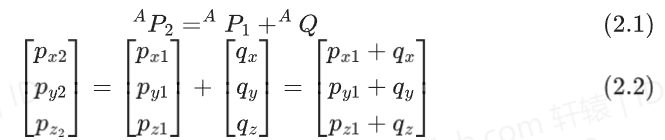
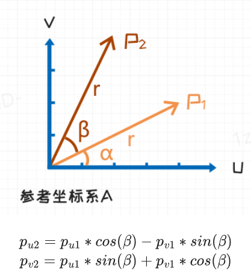
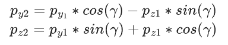
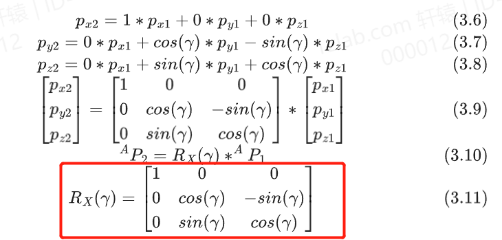
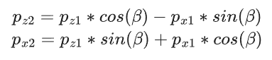
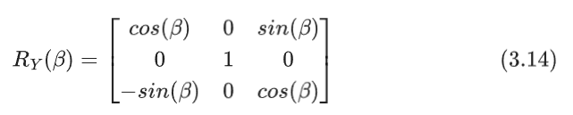
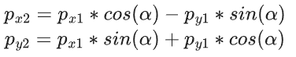
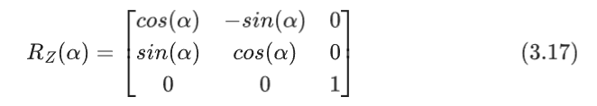

# 3D空间下向量的平移与旋转

>* #### 平移向量 (Translation Vector)
>
> 空间内向量的平移和平面内向量的平移一样，都是做向量加法。
>
> 
>
>示例代码： 3D空间下向量的平移与旋转.ipynb
>
> ```python
> """
> 将平移过程分别拆解成在X方向上平移，在Y方向上平移，在Z方向上平移
> """
> def translation_x(dx):
>     """沿X轴平移"""
>     return float32([
>         [1, 0, 0, dx],
>         [0, 1, 0, 0],
>         [0, 0, 1, 0]])
>
> def translation_y(dy):
>     """沿Y轴平移"""
>     return float32([
>         [1, 0, 0, 0],
>         [0, 1, 0, dy],
>         [0, 0, 1, 0]])
>
> def translation_z(dz):
>     """沿Z轴平移"""
>     return float32([
>         [1, 0, 0, 0],
>         [0, 1, 0, 0],
>         [0, 0, 1, dz]])
> ```
>
>* #### 旋转矩阵 (Rotation Matrix)
>
> 向量平面的旋转变换公式推导
>
> 
>
> * RX - 向量绕X轴旋转:
>
>   参照平面旋转公式可得：
>
>   矩阵运算的形式:
>
>   
>
>   示例代码： 3D空间下向量的平移与旋转.ipynb
>
>   ```python
>   def rotate_x(gamma):
>       """绕X轴旋转"""
>       return array([
>           [1, 0, 0, 0],
>           [0, cos(gamma), -sin(gamma), 0],
>           [0, sin(gamma), cos(gamma), 0]])
>   ```
>
> * RY - 向量绕Y轴旋转
>
>   参照平面旋转公式可得:
>
>   矩阵运算的形式:
>
>   
>
>   示例代码： 3D空间下向量的平移与旋转.ipynb
>
>   ```python
>   def rotate_y(beta):
>       """绕Y轴旋转"""
>       return array([
>           [cos(beta), 0, sin(beta), 0],
>           [0, 1, 0, 0],
>           [-sin(beta), 0, cos(beta), 0]])
>   ```
>
> * RZ - 向量绕Z轴旋转
>
>   参照平面旋转公式可得：
>
>   矩阵运算的形式:
>
>   
>
>   示例代码： 3D空间下向量的平移与旋转.ipynb
>
>   ```python
>   def rotate_z(alpha):
>       """绕Z轴旋转"""
>       return array([
>           [cos(alpha), -sin(alpha), 0, 0],
>           [sin(alpha), cos(alpha), 0, 0]])
>   ```
>
>* #### 变换矩阵 
>
> (旋转与平移的叠加，同时注意变换顺序是先旋转后平移)
>
> * 向量绕X轴旋转 -->> 向量绕X轴平移
> * 向量绕Y轴旋转 -->> 向量绕Y轴平移
> * 向量绕Z轴旋转 -->> 向量绕Z轴平移
>
>示例代码： 3D空间下向量的平移与旋转.ipynb
>
> ```python
> from numpy import set_printoptions, float32, eye, array, sqrt, copy, degrees
> from math import sin, cos, atan2, pi, radians
>
> # 设置Numpy打印精度
> set_printoptions(precision=3, suppress=True)
> # 定义向量
> p1 = array([0.5, 0.2, 0.8, 1]).reshape(-1, 1)
> # 平移向量
> q = array([0.5, 0, 0.2]).reshape(-1, 1)  
> # 旋转角度
> gamma = radians(30.0)  # 绕X轴旋转
> beta = radians(-45.0)  # 绕Y轴旋转
> alpha = radians(60.0)  # 绕Z轴旋转
>
> """
> 旋转：向量 * 旋转矩阵
> 平移：向量 * 平移矩阵
> """
> # 向量绕X轴旋转 -->> 向量绕X轴平移
> transformation_matrix  = rotate_x(gamma)
> transformation_matrix = transformation_matrix.dot(translation_x(0.5))
>
> # 向量绕Y轴旋转 -->> 向量绕Y轴平移
> transformation_matrix = transformation_matrix.dot(rotate_y(beta))
> transformation_matrix = transformation_matrix.dot(translation_y(0))
>
> # 向量绕Z轴旋转 -->> 向量绕Z轴平移
> transformation_matrix = transformation_matrix.dot(rotate_z(beta))
> transformation_matrix = transformation_matrix.dot(translation_z(0.2))
>
> # 打印变换矩阵
> print(transformation_matrix)
>
> # 计算变换后的点
> # 点 * 变换矩阵
> p2 = transformation_matrix.dot(p1)
> print(p1)
>
> """
> array([[ 0.143],
>        [-0.712],
>        [ 0.809],
>        [ 1.   ]])
> """
> ```


