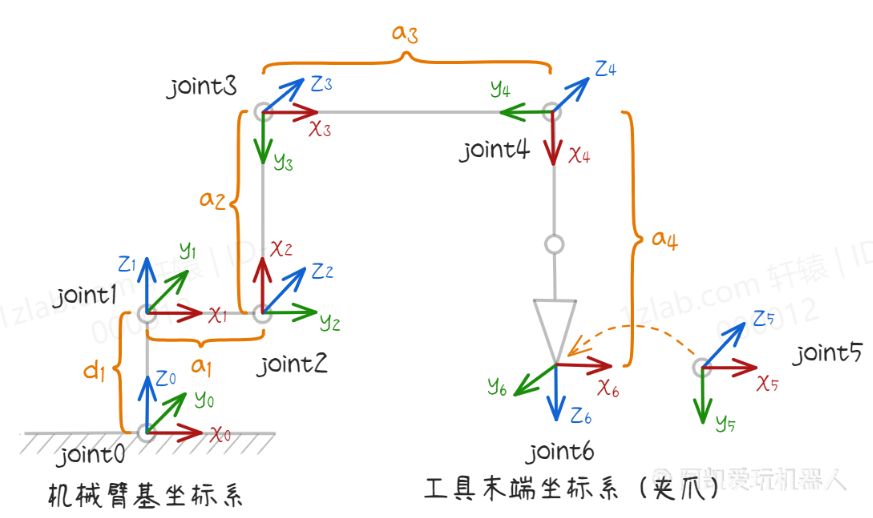
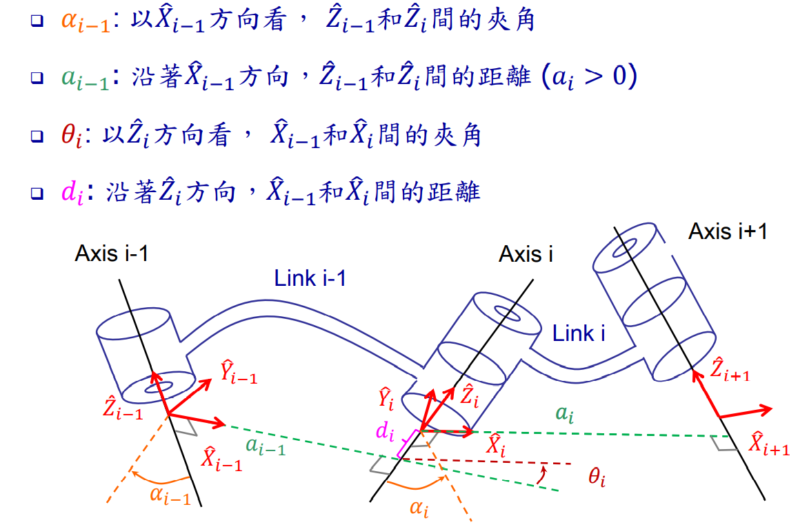
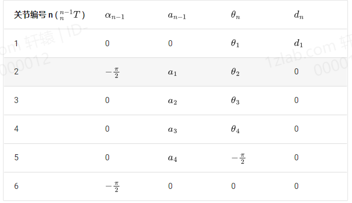
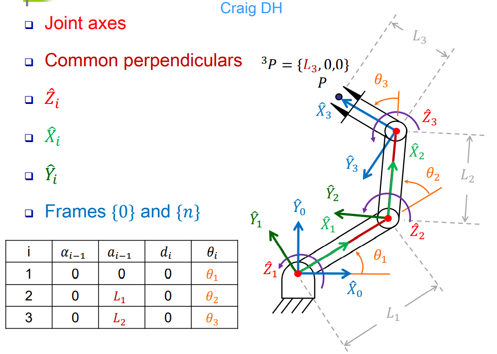
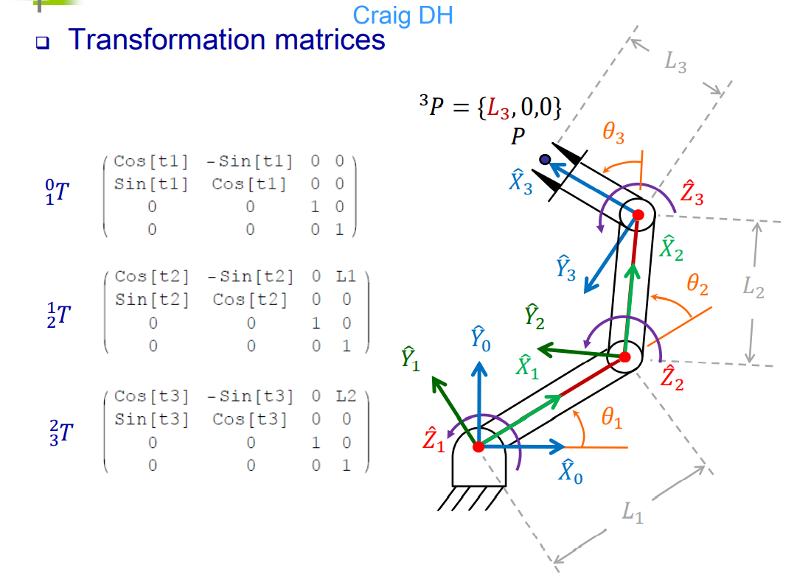

# 机械臂节点的坐标变换

以下以四自由度的DIY机械臂举例说明如何求得末端点相对于基坐标系的坐标

#### 基坐标系：



#### 关节坐标系：

* joint0 -- >> joint1

  在机械臂基坐标系 joint0 的基础上，绕Z轴旋转角度theta1，然后沿着Z轴平移d1得到 joint1坐标系 

* joint1 -- >> joint2

  在 joint1坐标系的基础上，绕X轴旋转角度 -pi/2，然后沿着X轴平移距离a1 。接下来绕Z轴旋转theta2角度得到joint2坐标系 

* joint2 -- >> joint3

  在 joint2坐标系的基础上，沿着X轴平移距离a2，然后绕Z轴旋转角度theta3得到joint3坐标系 

* joint3 -- >> joint4

  在joint3坐标系的基础上，沿着X轴平移距离a3，然后绕Z轴旋转theta4角度得到joint4坐标系 

* joint4 -- >> joint5

  在joint4坐标系的基础上，沿着X轴平移距离a4，然后绕Z轴旋转角度 -pi/2 得到joint5 坐标系 

* joint5 -- >> joint6

  在joint5坐标系的基础上，绕X轴旋转角度 -pi/2

**综上所述，机械臂从一个节点坐标系转换到另一个节点坐标系，主要是绕X轴旋转，绕X轴平移，绕Z轴旋转，绕Z轴平移。**

#### 坐标变换矩阵：

因此，可以根据此原理，写出节点的变换矩阵。（变换矩阵是什么及如何写变换矩阵可以查阅“3D空间下向量的平移和旋转”）

示例代码：transform.py

```python
# 绕X轴旋转
rotate_x

# 绕X轴平移
translation_x

# 绕Z轴旋转
rotate_z

# 绕Z轴平移
translation_z
```

```python
def dhmat(alpha, a, theta, d):
    """
    DH变换矩阵
    :param alpha:绕X轴旋转角度
    :param a:绕X轴平移距离
    :param theta:绕Z轴旋转角度
    :param d:绕Z轴平移距离
    :return:
    """
    result = rotate_x(alpha)
    result = result.dot(translation_x(a))
    result = result.dot(rotate_z(theta))
    result = result.dot(translation_z(d))
    return result
```

#### DH表：

由上python编写的变换矩阵代码实现可以得知：求得变换矩阵我们得需要知道四个参数：alpha,  a,  theta,  d

**DH表的最大作用就是为齐次变换矩阵 T 提供了必要的数值**

先看DH表是怎样得出的：



DH表可以查阅相关机械臂资料以及机械臂厂商提供。

这是示例机械臂中的DH表：



DH表达法用来定义我们的坐标系的作法，并且给出需要求解的数值（平移/旋转）在空间上的表达。或者说，根据我们定义的机械臂坐标系，可以得出DH表，并根据DH表中的数值，将其带入变换矩阵T，即可得出由此节点到另一节点间的变换。

当想要知道末端节点的位姿时，可以通过节点0与机械臂所有节点的变换矩阵相乘，得出末端节点的位姿。直白说法就是拿到了DH参数，就把表里的值代入到变换矩阵T中， 然后连乘，就能计算出末端位姿了。



示例代码：kinematic.py

```python
"""
假设示例机械臂的DH表
0       0       theta1      0
-pi/2   0       theta2      0
0       80      theta3      0
0       76      theta4      0
0       136     -pi/2       0
-pi/2   0       0           0
"""
# 求末端节点位姿
# 提取关节角度
theta1, theta2, theta3, theta4 = joint_angle
# 关节与关节之间的变换
t_01 = Transform.dhmat(0, 0, theta1, 0)
t_12 = Transform.dhmat(-pi / 2, 0, theta2, 0)
t_23 = Transform.dhmat(0, 80, theta3, 0)
t_34 = Transform.dhmat(0, 76, theta4, 0)
t_45 = Transform.dhmat(0, 136, -pi / 2, 0)
t_56 = Transform.dhmat(pi / 2, 0, 0, 0)
# 计算机械臂基坐标系到腕关节坐标系的变换
t_02 = t_01.dot(t_12)
t_03 = t_02.dot(t_23)
t_04 = t_03.dot(t_34)
t_05 = t_04.dot(t_45)
t_06 = t_05.dot(t_56)
# 创建位姿对象
pose = Posture()
pose.set_transform_matrix(t_06)
"""
因为变换矩阵包含了平移矩阵和旋转矩阵，所以：
set_transform_matrix的作用就是根据变换矩阵提取X, Y, Z 以及提起 roll, pitch, yaw
"""
```


